# System Architecture

## Overview

The Multi-Agent Jira Card Creation System is a containerized local application that automates the creation of high-quality Jira cards using AI agents with codebase analysis and database integration capabilities. The system analyzes 50+ local repositories and Oracle database schemas to generate context-aware, implementation-specific Jira cards. It follows a microservices-within-container pattern with clear separation between frontend, backend, repository analysis, database integration, and AI processing components.

## High-Level Architecture

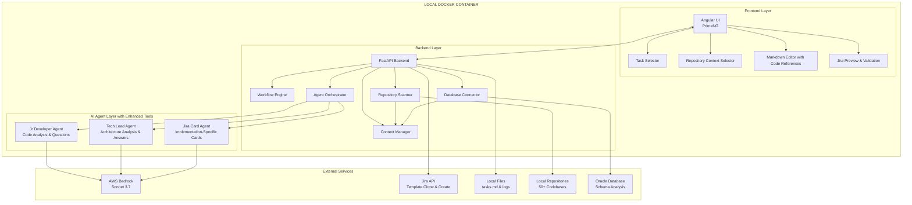

## Component Details

### Frontend Layer (Angular + PrimeNG)

**Technology Stack:**
- Angular 17+ with standalone components
- PrimeNG UI component library
- ngx-markdown for markdown rendering
- Monaco Editor for code editing

**Core Components:**
1. **Task List Component**
   - Displays parsed tasks from tasks.md
   - Shows status indicators (pending/in-progress/complete)
   - Refresh functionality for task file updates

2. **Repository Context Selector**
   - Displays available local repositories
   - Multi-select interface for relevant codebases
   - Repository structure preview
   - Database context selection

3. **Workflow Stepper Component**
   - Multi-step process visualization
   - Progress tracking and navigation
   - Error state handling
   - Repository and database analysis indicators

4. **Enhanced Markdown Editor Component**
   - Rich markdown editing with syntax highlighting
   - Code snippet integration and references
   - File path and line number linking
   - Database schema references
   - Real-time preview capabilities

5. **Jira Preview Component**
   - Side-by-side template vs generated card comparison
   - Field-by-field difference highlighting
   - Code and database reference validation
   - Final validation interface

**Services:**
- `TaskService`: Task management and status tracking
- `RepositoryService`: Repository selection and context management
- `DatabaseService`: Oracle connection and schema analysis
- `WorkflowService`: Pipeline orchestration with codebase analysis
- `JiraService`: Jira API integration
- `CodeReferenceService`: File and database reference management
- `ErrorService`: Global error handling and logging

### Backend Layer (FastAPI)

**Technology Stack:**
- FastAPI for REST API framework
- Pydantic for data validation
- Asyncio for concurrent processing
- Python logging with structured output

**Core Modules:**

1. **Workflow Engine (`workflow/`)**
   ```python
   class WorkflowEngine:
       - manage_task_lifecycle()
       - generate_request_guid()
       - track_pipeline_progress()
       - handle_state_persistence()
   ```

2. **Agent Orchestrator (`agents/`)**
   ```python
   class AgentOrchestrator:
       - initialize_strands_agents()
       - route_agent_requests()
       - handle_agent_responses()
       - manage_agent_lifecycle()
   ```

3. **Task Manager (`tasks/`)**
   ```python
   class TaskManager:
       - parse_tasks_markdown()
       - update_task_status()
       - persist_task_changes()
       - validate_task_format()
   ```

4. **Jira Integration (`jira/`)**
   ```python
   class JiraIntegration:
       - authenticate_with_pat()
       - clone_template_card()
       - clear_specified_fields()
       - create_new_card()
   ```

5. **Repository Scanner (`repository/`)**
   ```python
   class RepositoryScanner:
       - scan_repository_folder()
       - index_file_structure()
       - detect_languages_frameworks()
       - analyze_dependencies()
       - search_code_patterns()
       - read_specific_files()
   ```

6. **Database Connector (`database/`)**
   ```python
   class DatabaseConnector:
       - establish_jdbc_connection()
       - analyze_schema_structure()
       - execute_analysis_queries()
       - extract_table_metadata()
       - identify_relationships()
       - validate_connection_health()
   ```

7. **Context Manager (`context/`)**
   ```python
   class ContextManager:
       - manage_repository_context()
       - manage_database_context()
       - correlate_code_and_schema()
       - cache_analysis_results()
       - provide_agent_context()
   ```

### AI Agent Layer (Strands SDK)

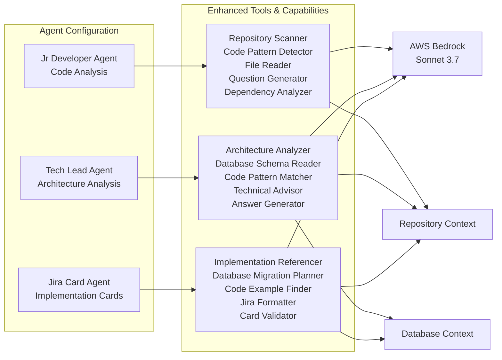

**Agent Architecture:**
Each agent is implemented as a separate Strands agent with specialized tools and prompts.

1. **Jr Developer Agent**
   ```python
   agent_config = {
       "name": "jr-developer",
       "model": "anthropic.claude-3-5-sonnet-v2",
       "system_prompt": jr_developer_prompt,
       "tools": [
           "repository_scanner",
           "file_reader",
           "code_pattern_detector",
           "dependency_analyzer",
           "requirement_analyzer",
           "question_generator"
       ]
   }
   ```

2. **Tech Lead Agent**
   ```python
   agent_config = {
       "name": "tech-lead", 
       "model": "anthropic.claude-3-5-sonnet-v2",
       "system_prompt": tech_lead_prompt,
       "tools": [
           "architecture_analyzer",
           "database_schema_reader",
           "code_pattern_matcher",
           "technical_analyzer",
           "cross_repo_searcher",
           "answer_generator"
       ]
   }
   ```

3. **Jira Card Agent**
   ```python
   agent_config = {
       "name": "jira-card",
       "model": "anthropic.claude-3-5-sonnet-v2", 
       "system_prompt": jira_card_prompt,
       "tools": [
           "implementation_referencer",
           "database_migration_planner",
           "code_example_finder",
           "file_path_linker",
           "jira_formatter",
           "card_validator"
       ]
   }
   ```

## Data Flow Architecture

### Request Processing Pipeline

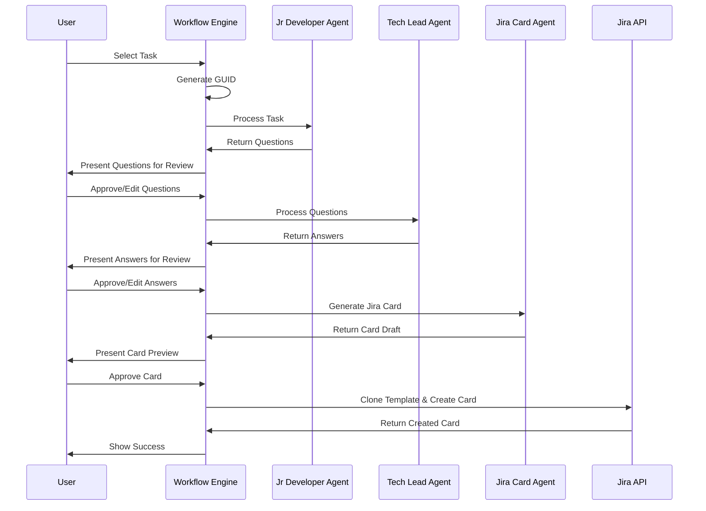

### Data Models

**Core Data Structures:**

```python
class WorkflowRequest:
    guid: str
    task_id: str
    status: WorkflowStatus
    created_at: datetime
    current_step: str
    
class TaskItem:
    id: str
    content: str
    status: TaskStatus
    created_at: datetime
    completed_at: Optional[datetime]

class AgentResponse:
    agent_name: str
    request_guid: str
    content: str
    metadata: dict
    processing_time: float

class JiraCard:
    template_key: str
    generated_fields: dict
    cleared_fields: list
    final_payload: dict
    code_references: List[CodeReference]
    database_references: List[DatabaseReference]

class RepositoryContext:
    repository_paths: List[str]
    selected_repos: List[str]
    languages: List[str]
    frameworks: List[str]
    file_structure: dict
    recent_changes: List[GitCommit]
    dependencies: dict

class DatabaseContext:
    jdbc_url: str
    schema_name: str
    connection_status: bool
    tables: List[TableMetadata]
    relationships: List[ForeignKeyRelation]
    recent_migrations: List[Migration]

class CodeReference:
    file_path: str
    line_number: Optional[int]
    function_name: Optional[str]
    class_name: Optional[str]
    description: str

class DatabaseReference:
    table_name: str
    column_names: List[str]
    operation_type: str  # SELECT, INSERT, UPDATE, DELETE
    description: str
```

## External Integration Details

### AWS Bedrock Integration

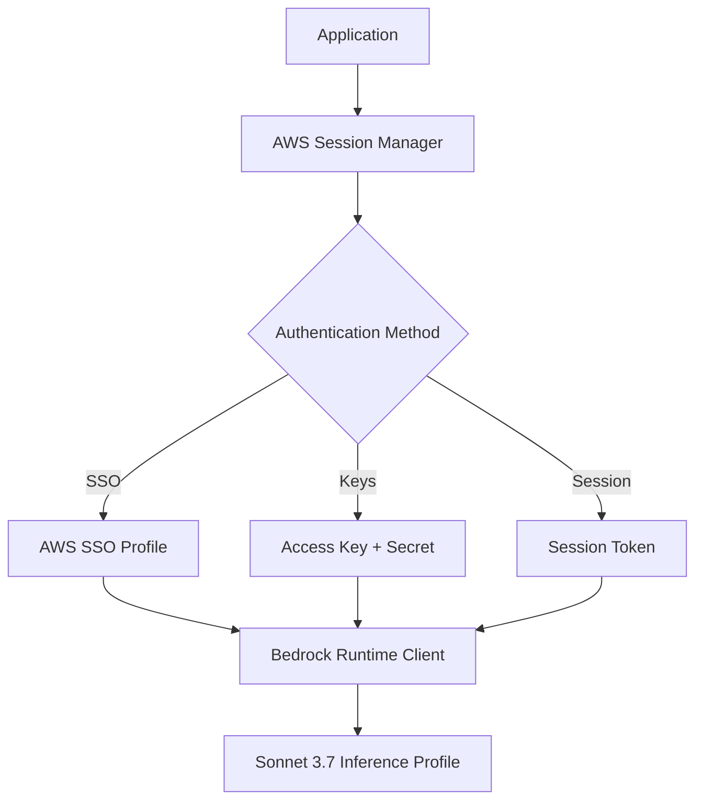

**Authentication:**
- AWS SSO profile support
- Access key/secret key authentication
- Session token handling
- Credential refresh logic

**Request Management:**
```python
class BedrockClient:
    def __init__(self, profile_name: str = None):
        self.session = boto3.Session(profile_name=profile_name)
        self.bedrock = self.session.client('bedrock-runtime')
    
    async def invoke_model(self, model_id: str, payload: dict):
        # Inference profile routing
        # Error handling and retries
        # Response parsing
```

### Jira API Integration

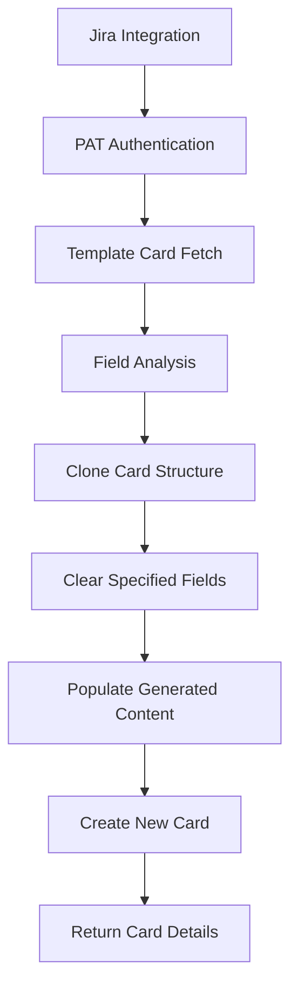

**Authentication:**
- Personal Access Token (PAT) based
- Token validation and refresh
- Permission verification

**Template Cloning Process:**
```python
class JiraTemplateCloner:
    def clone_card(self, template_key: str, new_content: dict):
        # 1. Fetch template card structure
        # 2. Identify fields to clear vs preserve
        # 3. Apply new content mappings
        # 4. Create new card via API
        # 5. Return created card details
```

**Field Management:**
```python
FIELDS_TO_CLEAR = [
    'customfield_10001',  # Sprint
    'customfield_10002',  # Epic
    'customfield_10003',  # Story Points
    'customfield_10004',  # Due Date
    'assignee',
    'description',
    'summary'
]
```

## Repository Analysis Architecture

### Repository Discovery and Indexing

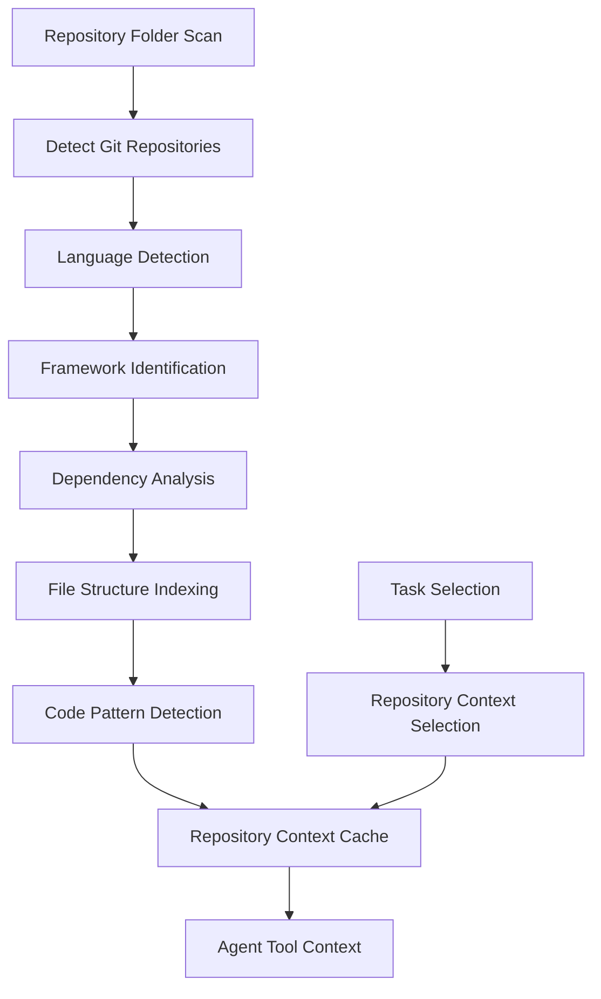

**Repository Scanning Process:**
```python
class RepositoryScanner:
    def scan_repositories(self, base_path: str) -> List[RepositoryInfo]:
        # 1. Discover all .git directories
        # 2. Analyze each repository structure
        # 3. Detect primary languages (Java, Python, JavaScript, etc.)
        # 4. Identify frameworks (Spring, React, Angular, etc.)
        # 5. Parse package files (pom.xml, package.json, requirements.txt)
        # 6. Index file structure and key directories
        # 7. Cache results for performance
        
    def search_code_patterns(self, pattern: str, repos: List[str]) -> List[Match]:
        # Search across selected repositories
        # Support regex and semantic search
        # Return file paths, line numbers, and context
        
    def analyze_dependencies(self, repo_path: str) -> DependencyGraph:
        # Parse dependency files
        # Identify external libraries
        # Map internal dependencies
        # Detect version conflicts
```

### Code Analysis Tools

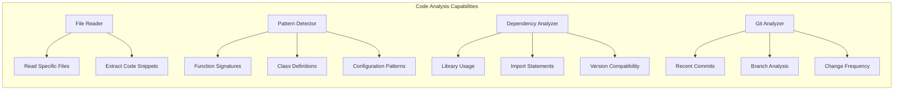

## Database Integration Architecture

### Oracle JDBC Connection Management

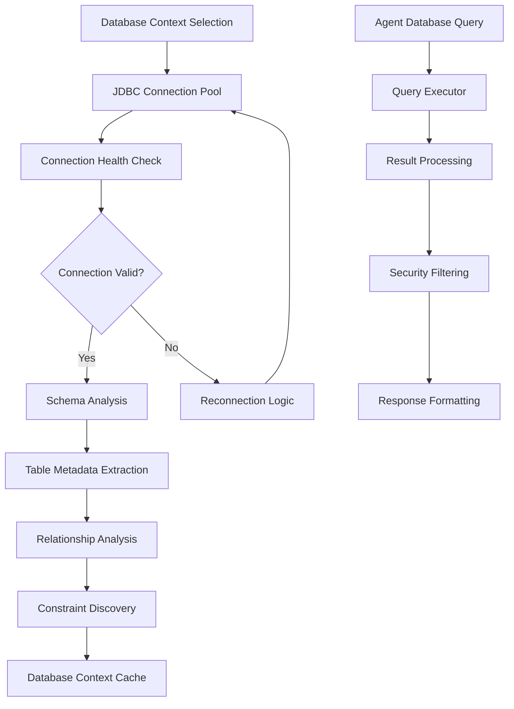

**Database Integration Components:**
```python
class DatabaseConnector:
    def __init__(self, jdbc_url: str, username: str, password: str):
        self.pool = create_connection_pool(jdbc_url, username, password)
        
    def analyze_schema(self, schema_name: str) -> SchemaAnalysis:
        # 1. Extract all table definitions
        # 2. Identify primary and foreign keys
        # 3. Analyze column types and constraints
        # 4. Map table relationships
        # 5. Identify indexes and performance considerations
        
    def execute_analysis_query(self, query: str) -> QueryResult:
        # Execute read-only queries for analysis
        # Enforce query timeouts
        # Log all database interactions
        # Filter sensitive data from results
        
    def get_table_sample(self, table_name: str, limit: int = 10) -> List[Row]:
        # Provide sample data for context
        # Respect data privacy policies
        # Mask sensitive columns
```

### Database Security and Privacy

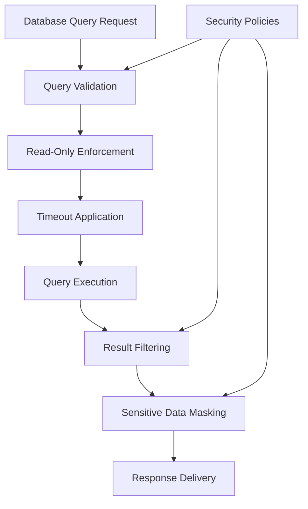

**Security Measures:**
- Read-only database access only
- Query timeout enforcement (30 seconds max)
- Sensitive data column identification and masking
- No data persistence outside of analysis context
- Connection credential encryption
- Audit logging of all database interactions

```
```

## Error Handling Strategy

### Error Categories

```mermaid
graph TD
    A[System Errors] --> A1[AWS Credential Failures]
    A[System Errors] --> A2[Network Connectivity]
    A[System Errors] --> A3[Container Resource Limits]
    
    B[Agent Errors] --> B1[Model Inference Failures]
    B[Agent Errors] --> B2[Prompt Processing Errors]
    B[Agent Errors] --> B3[Response Parsing Failures]
    
    C[Integration Errors] --> C1[Jira API Auth Failures]
    C[Integration Errors] --> C2[Template Not Found]
    C[Integration Errors] --> C3[Permission Denied]
    
    D[User Input Errors] --> D1[Invalid Task Format]
    D[User Input Errors] --> D2[Malformed Markdown]
    D[User Input Errors] --> D3[Missing Required Fields]
    
    E[Repository Errors] --> E1[Repository Not Found]
    E[Repository Errors] --> E2[File Access Denied]
    E[Repository Errors] --> E3[Git Operation Failures]
    
    F[Database Errors] --> F1[Connection Failures]
    F[Database Errors] --> F2[Schema Access Denied]
    F[Database Errors] --> F3[Query Timeout]
```

### Error Response Strategy

```python
class ErrorHandler:
    def handle_error(self, error: Exception, context: dict):
        # 1. Log error with GUID and context
        # 2. Classify error type
        # 3. Generate user-friendly message
        # 4. Preserve state for retry
        # 5. Return appropriate HTTP response
```

**No Fallback Policy:**
- System fails fast on any error
- No automatic retries or workarounds
- User must address error before proceeding
- Full error context preserved for debugging

## Deployment Architecture

### Container Structure

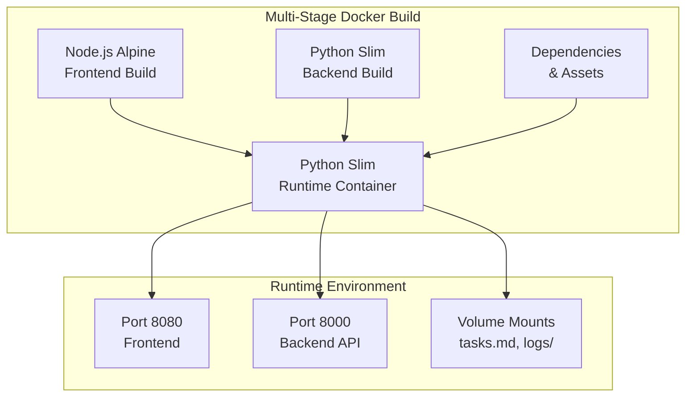

### Local Development Setup

```yaml
# docker-compose.yml
version: '3.8'
services:
  jira-card-creator:
    build: .
    ports:
      - "8080:8080"  # Frontend
      - "8000:8000"  # Backend API
    volumes:
      - ./tasks.md:/app/tasks.md
      - ./logs:/app/logs
      - ./repositories:/app/repositories:ro  # Read-only repository access
    environment:
      - AWS_PROFILE=${AWS_PROFILE}
      - JIRA_PAT=${JIRA_PAT}
      - JIRA_BASE_URL=${JIRA_BASE_URL}
      - REPOSITORY_BASE_PATH=/app/repositories
      - ORACLE_JDBC_URL=${ORACLE_JDBC_URL}
      - ORACLE_USERNAME=${ORACLE_USERNAME}
      - ORACLE_PASSWORD=${ORACLE_PASSWORD}
      - ORACLE_SCHEMA=${ORACLE_SCHEMA}
```

## Monitoring and Observability

### Logging Strategy

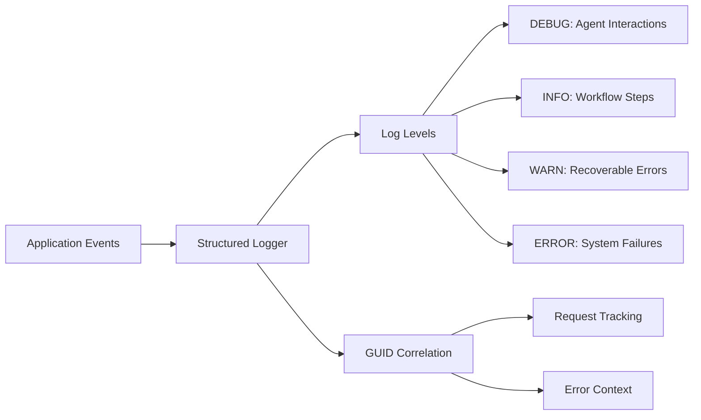

```python
import logging
import structlog

logger = structlog.get_logger()

def log_request(guid: str, step: str, data: dict):
    logger.info(
        "workflow_step_completed",
        request_guid=guid,
        step=step,
        processing_time=data.get('duration'),
        status=data.get('status')
    )
```

### Metrics Collection

- Request processing times per agent
- Error rates by category
- User interaction patterns
- Jira card creation success rates

## Security Considerations

### Credential Management
- AWS credentials never logged
- Jira PAT stored in environment variables
- No credential persistence in application state

### Data Privacy  
- Task content processed in memory only
- No sensitive data in logs
- Local-only processing (no cloud data storage)

### API Security
- Rate limiting on Jira API calls
- Input validation and sanitization
- HTTPS enforcement for external calls

## Performance Characteristics

### Expected Performance
- Repository scanning: 10-30 seconds (cached after first scan)
- Database schema analysis: 5-15 seconds (cached per schema)
- Task processing: 45-90 seconds end-to-end (including codebase analysis)
- Agent response time: 10-25 seconds per agent (with repository context)
- UI responsiveness: <200ms for user interactions
- Memory usage: <1GB under normal load (with repository indexing)
- Repository context switching: 1-3 seconds

### Scalability Constraints
- Single-user local deployment
- Sequential task processing
- No horizontal scaling capabilities
- Bounded by AWS Bedrock rate limits
- Repository scan performance scales with number of repositories
- Database query performance depends on schema complexity
- Memory usage increases with repository cache size