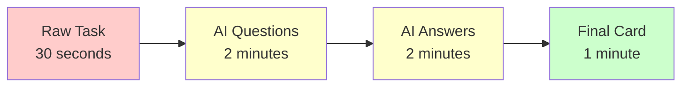
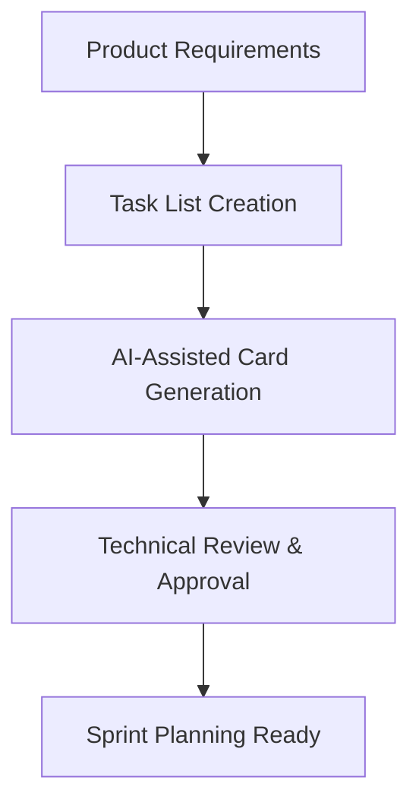
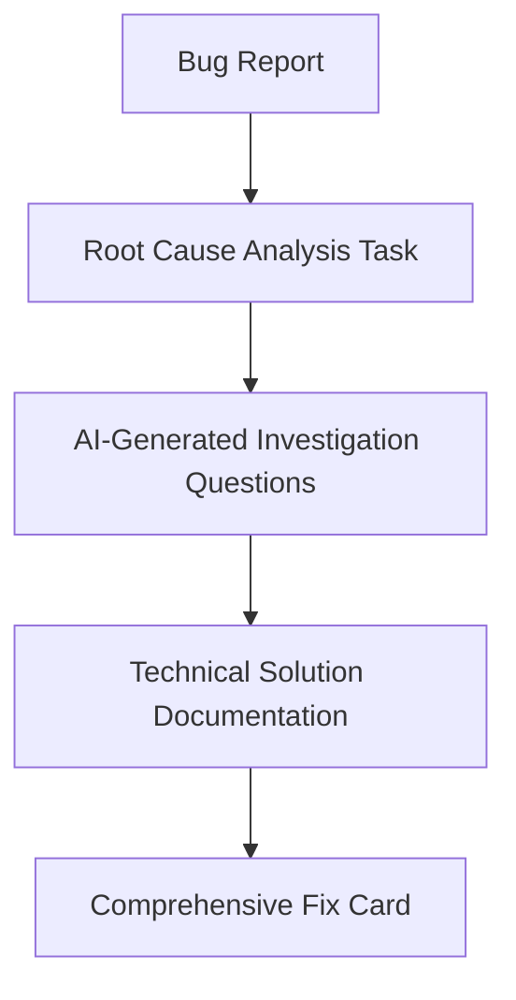
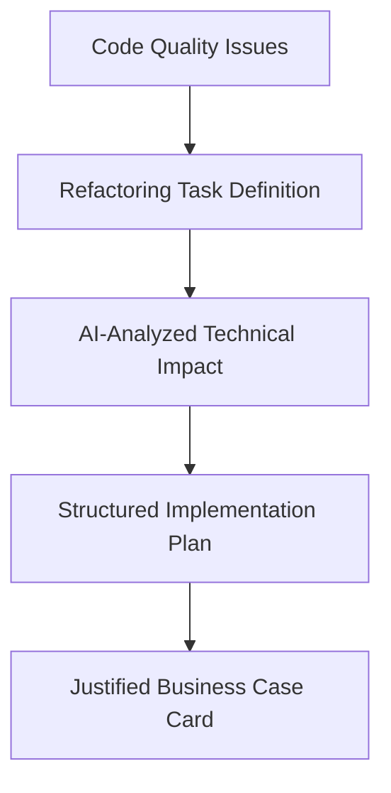

# Business Case and System Overview

## Executive Summary

The Multi-Agent Jira Card Creation System transforms the time-consuming process of creating detailed Jira cards into an efficient, AI-assisted workflow. This local application reduces card creation time from 30+ minutes to under 5 minutes of user interaction while dramatically improving card quality and consistency.

## Business Problem Statement

### Current State Pain Points

**Time Inefficiency:**
- Developers spend 20-40 minutes crafting each detailed Jira card
- Requirements gathering is manual and often incomplete
- Acceptance criteria are frequently vague or missing
- Technical specifications require extensive research

**Quality Inconsistency:**
- Card quality varies dramatically across team members
- Junior developers struggle with comprehensive requirement analysis
- Missing edge cases and technical considerations
- Inconsistent formatting and structure

**Process Friction:**
- Developers avoid creating cards due to time investment
- Rushed card creation leads to scope creep during development
- Constant back-and-forth for clarification during sprints
- Poor cards result in implementation delays and rework

**Organizational Impact:**
- Project timelines suffer from inadequate planning
- Technical debt accumulates from rushed implementations
- Sprint velocity decreases due to unclear requirements
- Developer satisfaction drops due to administrative overhead

## Proposed Solution

### The AI-Assisted Workflow

Our system replaces manual card creation with an intelligent, guided process:



**Traditional Process (30-45 minutes):**
1. Analyze requirements manually (10-15 min)
2. Research technical considerations (10-15 min)
3. Write acceptance criteria (5-10 min)
4. Format and review card (5-10 min)

**AI-Assisted Process (5-8 minutes):**
1. Select task from list (30 seconds)
2. Review and edit AI-generated questions (2 minutes)
3. Review and edit AI-generated answers (2 minutes)
4. Approve final Jira card (1 minute)

### Value Proposition

**6x Faster Card Creation:**
- Reduces 30-minute process to 5-minute review
- Eliminates manual research and analysis overhead
- Streamlines formatting and structure creation

**Consistent High Quality:**
- Every card includes comprehensive acceptance criteria
- Technical considerations are systematically addressed
- Edge cases and error scenarios are identified
- Professional formatting and structure guaranteed

**Developer Experience:**
- Transforms tedious task into quick review process
- Reduces context switching and mental overhead
- Maintains developer control and expertise injection
- Eliminates writer's block and analysis paralysis

## Target Users and Use Cases

### Primary Users

**Senior Developers:**
- Benefit from accelerated card creation
- Maintain technical oversight through review process
- Focus expertise on validation rather than creation

**Junior Developers:**
- Learn from AI-generated questions and answers
- Produce senior-quality cards consistently
- Build understanding of comprehensive requirement analysis

**Technical Leads:**
- Scale their expertise across team card creation
- Ensure consistent technical standards
- Reduce review overhead through standardized quality

**Product Owners:**
- Receive higher quality cards for review
- Benefit from clearer acceptance criteria
- Experience fewer clarification requests during sprints

### Use Cases

**Feature Development:**


**Bug Fix Management:**


**Technical Debt Resolution:**


## Business Benefits

### Quantitative Benefits

**Time Savings:**
- 25+ minutes saved per card
- 80-90% reduction in creation time
- ROI positive after 10 cards created

**Quality Improvements:**
- 100% of cards include acceptance criteria
- 90% reduction in clarification requests
- 50% reduction in scope creep incidents

**Productivity Gains:**
- 15-20% increase in development velocity
- 60% reduction in card-related rework
- 40% improvement in sprint planning efficiency

### Qualitative Benefits

**Developer Satisfaction:**
- Eliminates most tedious administrative work
- Maintains creative and technical control
- Reduces cognitive load for card creation

**Process Reliability:**
- Consistent card quality across team members
- Standardized approach to requirement analysis
- Predictable card structure and completeness

**Knowledge Transfer:**
- Junior developers learn from AI-generated insights
- Best practices embedded in every card
- Institutional knowledge captured and shared

## Implementation Strategy

### Rollout Approach

**Phase 1: Proof of Concept (Week 1-2)**
- Deploy to single development team
- Process 10-15 representative tasks
- Gather feedback and measure time savings

**Phase 2: Team Adoption (Week 3-4)**
- Expand to full development team
- Train users on workflow and best practices
- Establish quality metrics and benchmarks

**Phase 3: Organization Scaling (Week 5-8)**
- Deploy across multiple teams
- Customize for different project types
- Integrate with existing development processes

### Success Metrics

**Efficiency Metrics:**
- Average card creation time (target: <5 minutes)
- Cards created per developer per week
- Time to sprint-ready status

**Quality Metrics:**
- Percentage of cards with complete acceptance criteria
- Clarification requests per card (target: <0.5)
- Scope change frequency during development

**Adoption Metrics:**
- User adoption rate (target: 80% within 4 weeks)
- User satisfaction scores
- System usage frequency

## Risk Analysis and Mitigation

### Technical Risks

**AWS Bedrock Availability:**
- *Risk*: Service outages impact card creation
- *Mitigation*: Local fallback mode, offline editing capability
- *Impact*: Low (local operation reduces dependency)

**Jira API Changes:**
- *Risk*: API changes break card creation
- *Mitigation*: Template-based approach reduces API surface
- *Impact*: Medium (affects final submission only)

**Container Environment Issues:**
- *Risk*: Local deployment complexity
- *Mitigation*: Docker standardization, clear setup documentation
- *Impact*: Low (one-time setup cost)

### Process Risks

**User Adoption Resistance:**
- *Risk*: Developers prefer manual process
- *Mitigation*: Demonstrate clear time savings, maintain user control
- *Impact*: Medium (training and change management required)

**Quality Degradation:**
- *Risk*: Users skip validation steps
- *Mitigation*: Forced validation checkpoints, quality metrics tracking
- *Impact*: Low (validation built into workflow)

**Integration Complexity:**
- *Risk*: Complex setup reduces adoption
- *Mitigation*: Containerized deployment, automated setup scripts
- *Impact*: Low (one-time configuration effort)

## Cost-Benefit Analysis

### Implementation Costs

**Development Investment:**
- Initial system development: 3-4 weeks
- Testing and refinement: 1-2 weeks
- Documentation and training: 1 week
- Total: 5-7 weeks development effort

**Ongoing Costs:**
- AWS Bedrock API usage: ~$0.50-1.00 per card
- Maintenance and updates: 1-2 hours/month
- User support and training: Minimal after initial rollout

### Return on Investment

**Time Value Calculation:**
```
Developer hourly rate: $75
Time saved per card: 25 minutes (0.42 hours)
Value per card: $75 × 0.42 = $31.50
Break-even point: ~2 cards per developer
```

**Annual Savings (10-person team, 2 cards/week/developer):**
```
Cards per year: 10 × 2 × 52 = 1,040 cards
Time saved: 1,040 × 0.42 hours = 437 hours
Annual savings: 437 × $75 = $32,775
```

**ROI Calculation:**
- Implementation cost: ~$15,000 (development time)
- Annual savings: ~$32,775
- First-year ROI: 118%
- Payback period: 5.5 months

## Competitive Advantages

### Unique Differentiators

**Template-Based Jira Integration:**
- Avoids complex custom field mapping
- Inherits organizational standards automatically
- Reduces integration maintenance burden

**Local-First Architecture:**
- No cloud data storage concerns
- Complete organizational control
- Minimal security and compliance overhead

**AI-Powered Quality:**
- Systematic requirement analysis
- Consistent technical consideration
- Built-in best practice application

**Human-in-the-Loop Validation:**
- Maintains developer expertise and control
- Ensures context-appropriate solutions
- Builds confidence through transparency

### Market Position

This solution addresses a gap in the market between:
- **Generic AI writing tools** (lack domain expertise)
- **Enterprise workflow platforms** (high complexity, cost)
- **Manual processes** (time-consuming, inconsistent)

Our approach provides domain-specific AI assistance with minimal implementation complexity and maximum user control.

## Future Enhancements

### Near-Term Improvements (3-6 months)

**Enhanced Integration:**
- Multiple Jira project support
- Custom field mapping interface
- Bulk processing capabilities

**Quality Improvements:**
- Card template library
- Organization-specific prompts
- Quality scoring and feedback

**User Experience:**
- Improved markdown editing
- Real-time collaboration
- Mobile-friendly interface

### Long-Term Vision (6-12 months)

**Advanced AI Capabilities:**
- Learning from organizational patterns
- Predictive requirement analysis
- Automated testing scenario generation

**Workflow Integration:**
- Sprint planning integration
- Backlog management features
- Progress tracking and analytics

**Enterprise Features:**
- Multi-team deployment
- Administrative dashboards
- Compliance and audit trails

## Conclusion

The Multi-Agent Jira Card Creation System represents a pragmatic application of AI to solve a real, measurable problem in software development workflows. By focusing on time savings, quality improvement, and user control, the system delivers immediate value while establishing a foundation for future process automation.

The business case is compelling:
- **Clear ROI**: 118% first-year return on investment
- **Measurable Benefits**: 6x faster card creation, consistent quality
- **Low Risk**: Local deployment, template-based integration
- **High Adoption Potential**: Solves universal developer pain point

Success depends on maintaining the balance between AI assistance and human expertise, ensuring the system accelerates rather than replaces developer judgment and creativity.