# Workflow Flow Documentation

## Overview

This document describes the detailed workflow for the Multi-Agent Jira Card Creation System. The system processes tasks through a sequential pipeline of AI agents, with human validation at each step.

## High-Level Flow Diagram

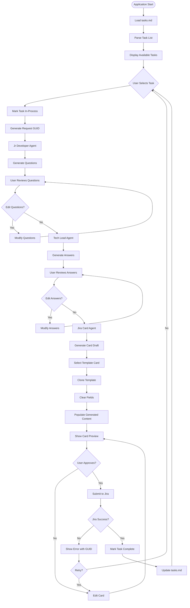

## Detailed Step-by-Step Process

### Phase 1: Application Initialization

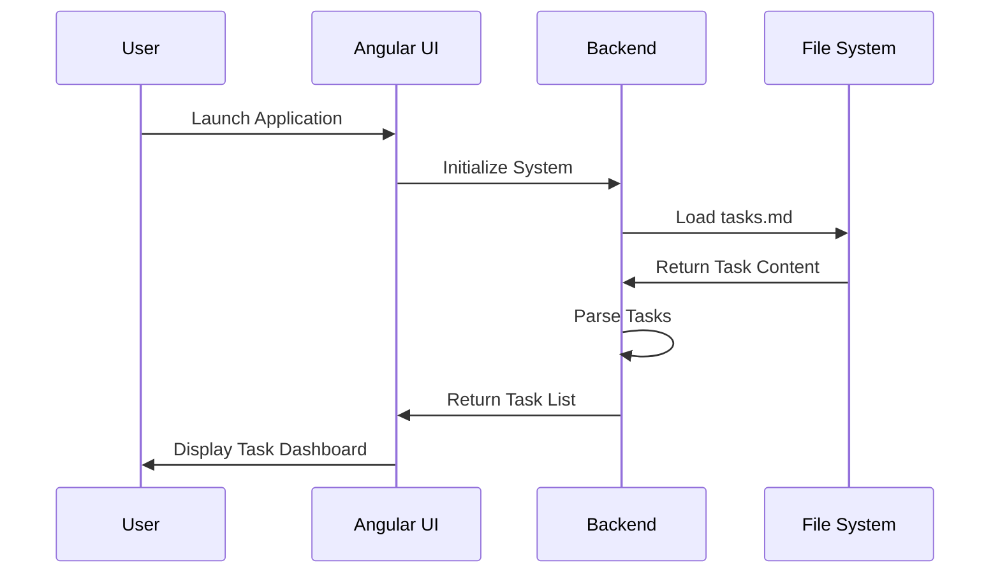

**Steps:**
1. **Application Startup**
   - Docker container initializes
   - Backend services start
   - Frontend loads and connects to API

2. **Task File Loading**
   - Read tasks.md from file system
   - Parse markdown format
   - Extract individual tasks
   - Determine task status (pending/in-progress/complete)

3. **UI Initialization**
   - Display task list with status indicators
   - Show refresh button for task file updates
   - Enable task selection interface

### Phase 2: Task Selection and Processing

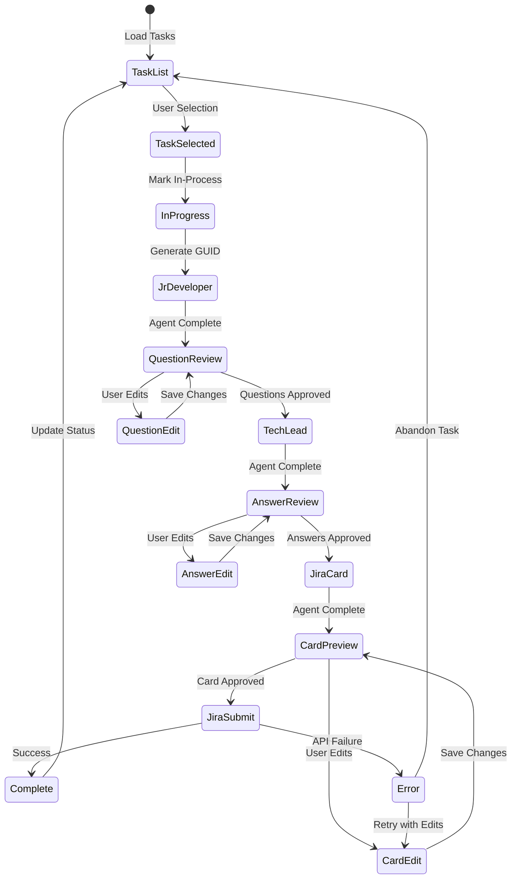

### Phase 3: Jr Developer Agent Processing

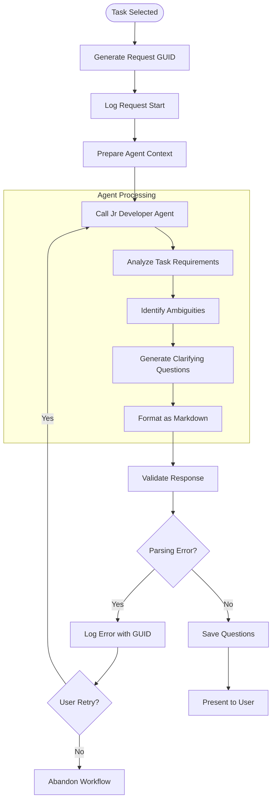

**Jr Developer Agent Behavior:**
- Reads task description carefully
- Identifies missing technical specifications
- Generates 5-10 specific questions
- Focuses on implementation details
- Outputs structured markdown format

**Example Questions Generated:**
```markdown
## Developer Questions

1. Which Java version and build tool should the SDK target (Maven vs Gradle)?
2. What GraphQL schema introspection endpoint format do the nf-graphql services expose?
3. Should the SDK include client-side caching mechanisms or connection pooling?
4. What authentication mechanism should the SDK support for the GraphQL endpoints?
5. Should the SDK be published to a public repository (Maven Central) or private artifact repository?
```

### Phase 4: User Question Review

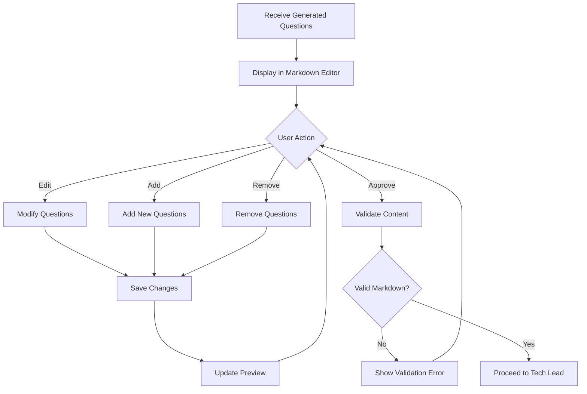

### Phase 5: Tech Lead Agent Processing

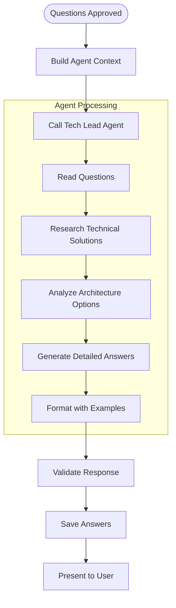

**Tech Lead Agent Behavior:**
- Analyzes each question thoroughly
- Provides detailed technical answers
- Includes code examples when relevant
- References best practices and patterns
- Explains architectural decisions

**Example Answers Generated:**
```markdown
## Developer Answers

### Question 1: Which Java version and build tool should the SDK target?
**Answer**: Target Java 11+ with Maven for broader compatibility. The GraphQL Java libraries have excellent Maven support and most enterprise environments can handle Java 11+.

**Code Example**: 
```xml
<dependency>
    <groupId>com.graphql-java</groupId>
    <artifactId>graphql-java-tools</artifactId>
    <version>5.2.4</version>
</dependency>
```

**Best Practices**: Use Maven's dependency management for consistent builds across environments.
```

### Phase 6: User Answer Review

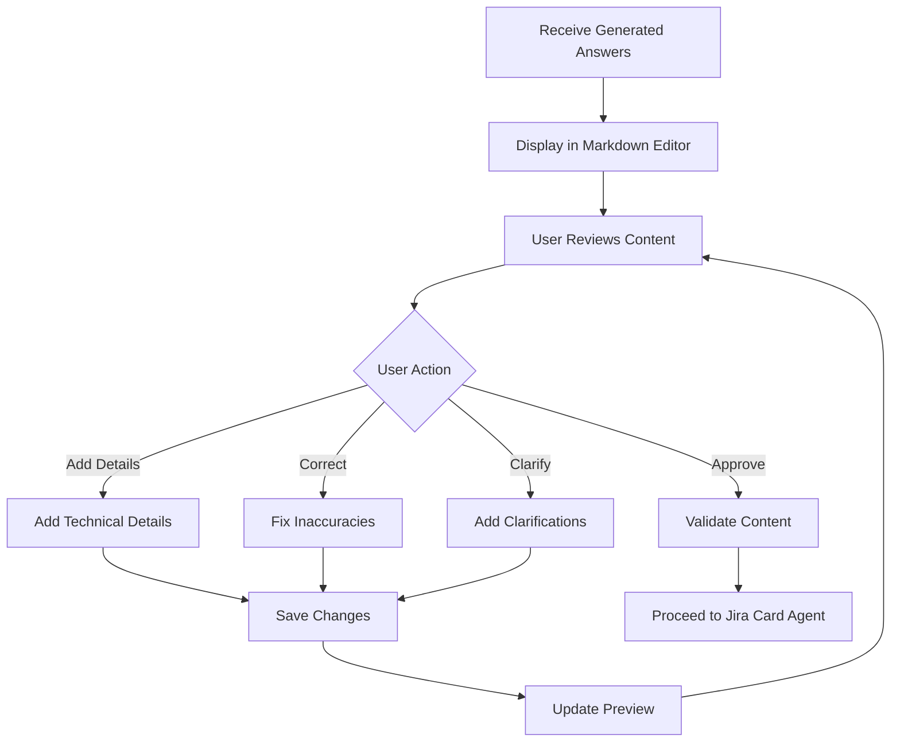

### Phase 7: Jira Card Agent Processing

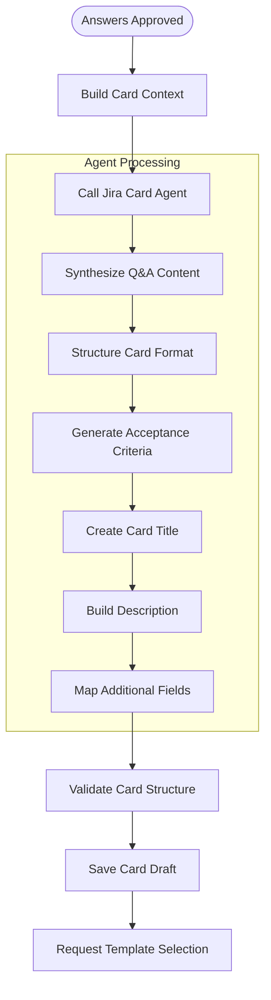

**Jira Card Agent Behavior:**
- Synthesizes questions and answers into coherent requirements
- Generates clear, actionable title
- Creates structured description with acceptance criteria
- Maps content to appropriate Jira fields
- Ensures testable, measurable criteria

### Phase 8: Jira Template Integration

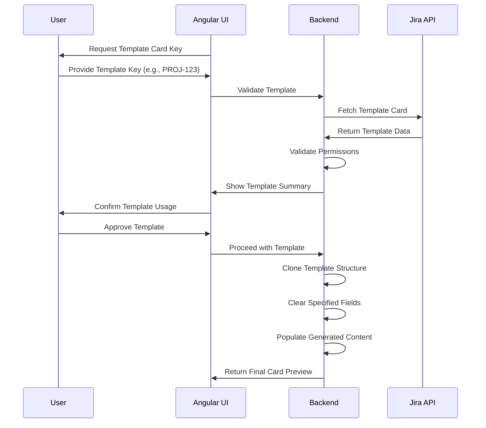

**Template Processing Steps:**
1. **Template Validation**
   - Verify card exists and is accessible
   - Check user permissions
   - Display template summary for confirmation

2. **Field Analysis**
   - Identify fields to preserve (project, components, etc.)
   - Identify fields to clear (sprint, epic, points, etc.)
   - Map generated content to appropriate fields

3. **Card Assembly**
   - Clone template structure
   - Clear specified fields
   - Populate with generated content
   - Preserve organizational settings

### Phase 9: Final Review and Submission

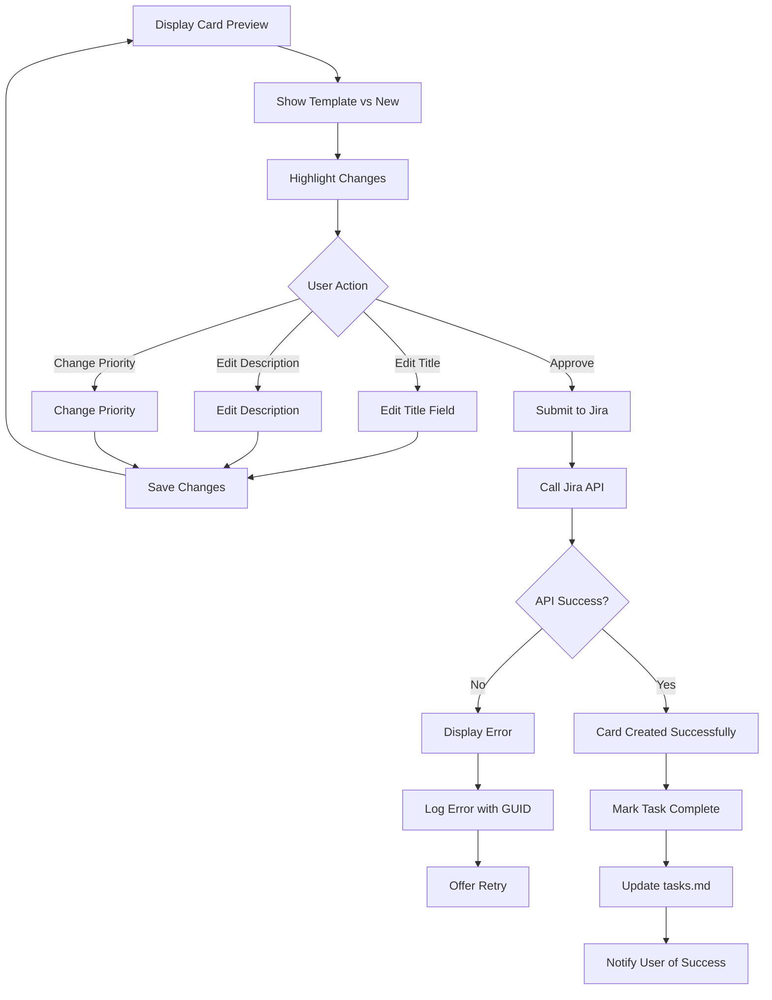

### Phase 10: Error Handling and Recovery

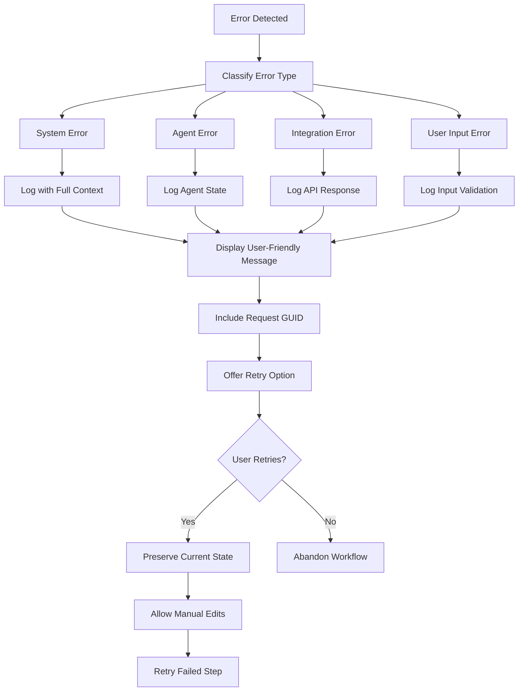

**Error Handling Principles:**
- **Fail Fast**: Stop immediately on any error
- **Preserve Context**: Save all state for retry
- **Clear Communication**: Show user-friendly error messages
- **Traceable**: Include GUID for debugging
- **No Fallbacks**: User must address error to proceed

## State Management

### Workflow State Transitions

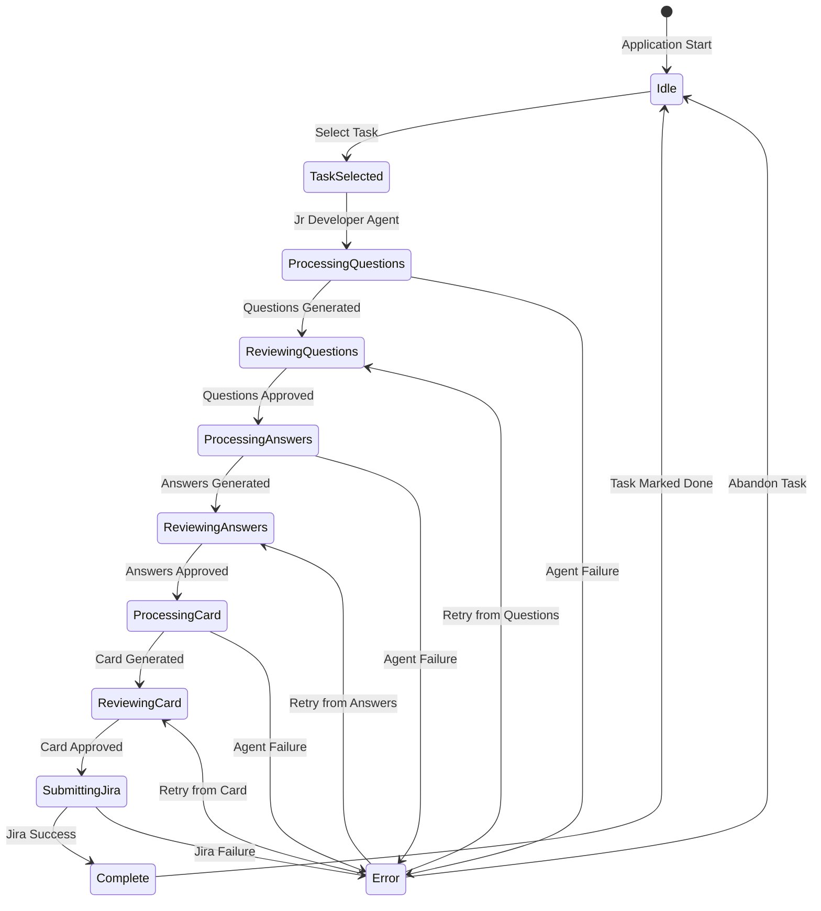

### Data Persistence Strategy

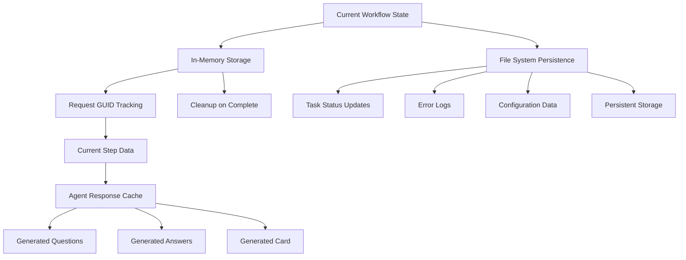

## Performance Expectations

### Timing Breakdown

| Phase | Expected Duration | Critical Path |
|-------|------------------|---------------|
| Task Selection | <1 second | UI Interaction |
| Jr Developer Agent | 5-15 seconds | Bedrock API Call |
| Question Review | User-dependent | Human Review |
| Tech Lead Agent | 10-20 seconds | Bedrock API Call |
| Answer Review | User-dependent | Human Review |
| Jira Card Agent | 5-10 seconds | Bedrock API Call |
| Template Processing | 1-3 seconds | Jira API Call |
| Card Review | User-dependent | Human Review |
| Jira Submission | 2-5 seconds | Jira API Call |

**Total End-to-End Time:** 25-55 seconds (excluding human review time)

### Optimization Opportunities

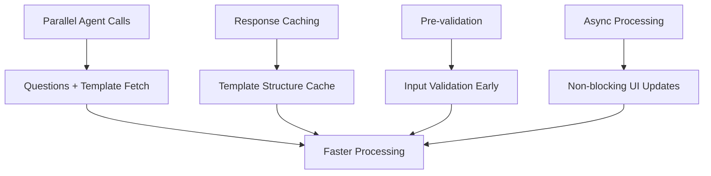

This workflow ensures reliable, user-controlled progression through the AI-assisted Jira card creation process while maintaining quality and providing clear error handling at every step.